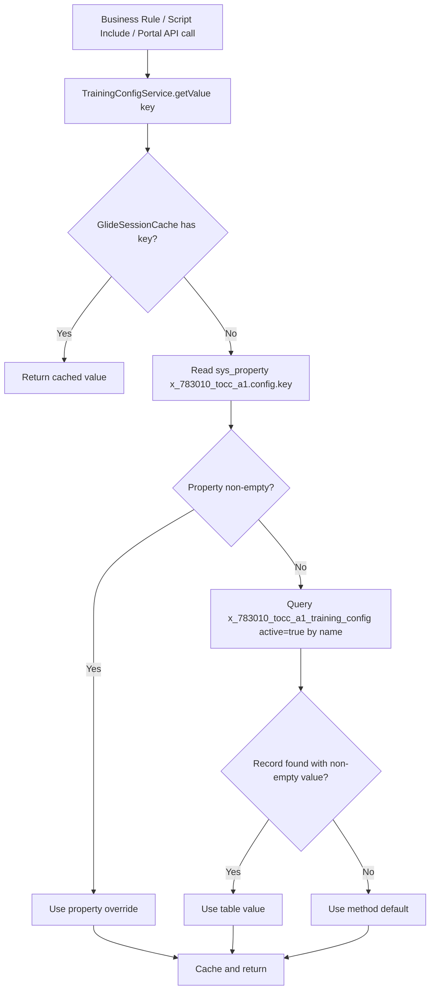

# Configuration Resolution Diagram

## Notes

- Runtime precedence is `sys_properties` override first, table fallback second.
- Empty property value intentionally means "fallback to table/default".
- Session cache avoids repeated database hits in the same transaction context.

