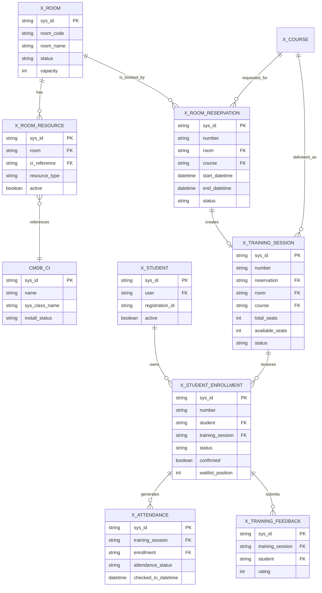

# Domain Model Diagram

```mermaid
erDiagram
    X_ROOM ||--o{ X_ROOM_RESOURCE : has
    X_ROOM ||--o{ X_ROOM_RESERVATION : is_booked_by
    X_ROOM_RESERVATION ||--o| X_TRAINING_SESSION : creates
    X_COURSE ||--o{ X_ROOM_RESERVATION : requested_for
    X_COURSE ||--o{ X_TRAINING_SESSION : delivered_as
    X_TRAINING_SESSION ||--o{ X_STUDENT_ENROLLMENT : receives
    X_STUDENT ||--o{ X_STUDENT_ENROLLMENT : owns
    X_STUDENT_ENROLLMENT ||--o{ X_ATTENDANCE : generates
    X_STUDENT_ENROLLMENT ||--o{ X_TRAINING_FEEDBACK : submits
    X_ROOM_RESOURCE }o--|| CMDB_CI : references

    X_ROOM {
      string sys_id PK
      string room_code
      string room_name
      string status
      int capacity
    }
    X_ROOM_RESOURCE {
      string sys_id PK
      string room FK
      string ci_reference FK
      string resource_type
      boolean active
    }
    X_ROOM_RESERVATION {
      string sys_id PK
      string number
      string room FK
      string course FK
      datetime start_datetime
      datetime end_datetime
      string status
    }
    X_TRAINING_SESSION {
      string sys_id PK
      string number
      string reservation FK
      string room FK
      string course FK
      int total_seats
      int available_seats
      string status
    }
    X_STUDENT {
      string sys_id PK
      string user FK
      string registration_id
      boolean active
    }
    X_STUDENT_ENROLLMENT {
      string sys_id PK
      string number
      string student FK
      string training_session FK
      string status
      boolean confirmed
      int waitlist_position
    }
    X_ATTENDANCE {
      string sys_id PK
      string training_session FK
      string enrollment FK
      string attendance_status
      datetime checked_in_datetime
    }
    X_TRAINING_FEEDBACK {
      string sys_id PK
      string training_session FK
      string student FK
      int rating
    }
    CMDB_CI {
      string sys_id PK
      string name
      string sys_class_name
      string install_status
    }
```

