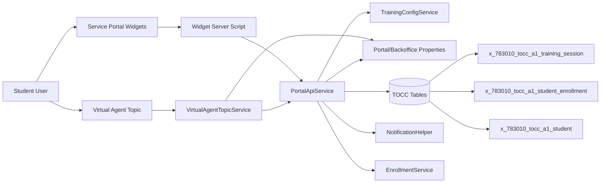

# Portal and Virtual Agent Integration Diagram

## Notes

- Virtual Agent uses `VirtualAgentTopicService` as a single backend adapter.
- Portal widgets and VA share policy/link outputs via `PortalApiService` + properties.
- Enrollment cancellation path triggers seat sync and notification flow.

