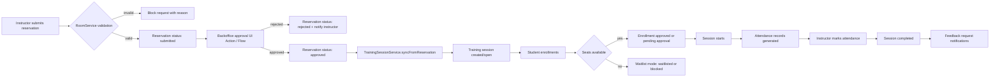

# Reservation Lifecycle Diagram

```mermaid
flowchart LR
    A[Instructor submits reservation] --> B{RoomService validation}
    B -->|invalid| BX[Block request with reason]
    B -->|valid| C[Reservation status: submitted]
    C --> D[Backoffice approval UI Action / Flow]
    D -->|rejected| E[Reservation status: rejected + notify instructor]
    D -->|approved| F[Reservation status: approved]
    F --> G[TrainingSessionService.syncFromReservation]
    G --> H[Training session created/open]
    H --> I[Student enrollments]
    I --> J{Seats available}
    J -->|yes| K[Enrollment approved or pending approval]
    J -->|no| L[Waitlist mode: waitlisted or blocked]
    K --> M[Session starts]
    M --> N[Attendance records generated]
    N --> O[Instructor marks attendance]
    O --> P[Session completed]
    P --> Q[Feedback request notifications]
```

