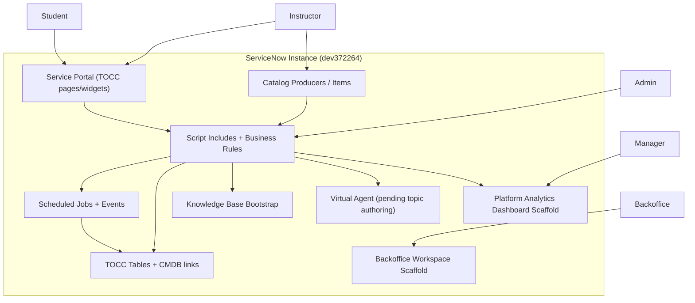

# System Context Diagram

```mermaid
flowchart TB
    Student[Student]
    Instructor[Instructor]
    Backoffice[Backoffice]
    Manager[Manager]
    Admin[Admin]

    subgraph SN["ServiceNow Instance (dev372264)"]
        Portal["Service Portal (TOCC pages/widgets)"]
        Catalog["Catalog Producers / Items"]
        Logic["Script Includes + Business Rules"]
        Jobs["Scheduled Jobs + Events"]
        Workspace["Backoffice Workspace Scaffold"]
        Analytics["Platform Analytics Dashboard Scaffold"]
        KB["Knowledge Base Bootstrap"]
        VA["Virtual Agent (pending topic authoring)"]
        Data["TOCC Tables + CMDB links"]
    end

    Student --> Portal
    Instructor --> Portal
    Instructor --> Catalog
    Backoffice --> Workspace
    Manager --> Analytics
    Admin --> Logic

    Portal --> Logic
    Catalog --> Logic
    Logic --> Jobs
    Jobs --> Data
    Logic --> Data
    Logic --> KB
    Logic --> VA
    Logic --> Analytics
```

