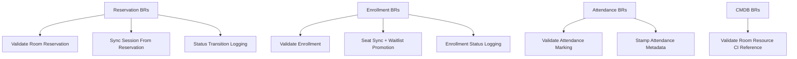

# TOCC Business Rule Map

## Active Rule Domains

## Why this file exists

- Keeps business-rule scope explicit for future contributors.
- Provides a quick visual index for pending migrations to dedicated BR modules.
