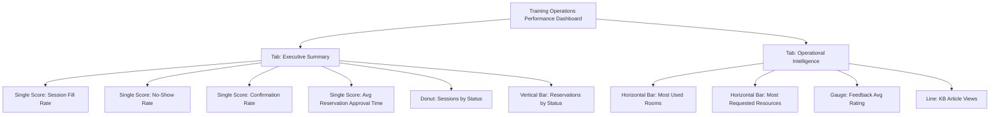

# Platform Analytics Layout (SDK + Manual Refinement)

This diagram mirrors the dashboard scaffold implemented in `platform-analytics-dashboard.now.ts`.

## Operational note

- Widget rendering is delivered via SDK metadata.
- Final indicator formulas and data collectors continue in Performance Analytics UI as planned in `PLATFORM_ANALYTICS_KPIS.md`.
