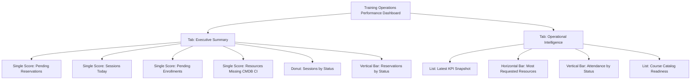

# Platform Analytics Layout (SDK + Manual Refinement)

This diagram mirrors the dashboard scaffold implemented in `platform-analytics-dashboard.now.ts`.

## Operational note

- Widget rendering is delivered via SDK metadata and uses operational tables plus the app-scoped `x_783010_tocc_a1_kpi_snapshot` table.
- The daily collector `[TOCC] Collect KPI Snapshots` writes the KPI snapshot used by the portal home and the Platform Analytics list widget.
- The portal home shows the high-signal operational snapshot for `backoffice`, `manager`, and `admin` personas so those users do not land on an empty home page before opening Platform Analytics.
