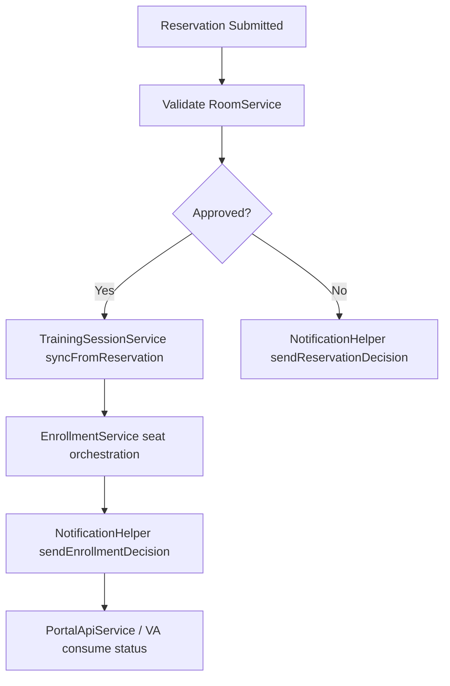

# TOCC Flow Orchestration Map

This folder now contains both the orchestration design map and SDK materialized flow scaffolds.

## Current runtime path (Script Includes + BR + Scheduled Jobs)



## SDK materialized flow scaffolds

```mermaid
flowchart LR
    F1[[[TOCC][FLOW] Reservation Intake Signal]] --> SF1[[[TOCC][SF] Emit Reservation Intake Signal]]
    F2[[[TOCC][FLOW] Session Cancelled Signal]] --> SF2[[[TOCC][SF] Emit Session Cancelled Signal]]
    F3[[[TOCC][FLOW] Daily KPI Refresh Signal]]
```

## Source of truth

- Flows and subflows are defined in `training-orchestration-flows.now.ts`.
- Activation and smoke checks are documented in `docs/manual-config/flow-scaffold-activation.md`.
- Core business rules remain implemented in Script Includes/BRs to avoid logic duplication.
