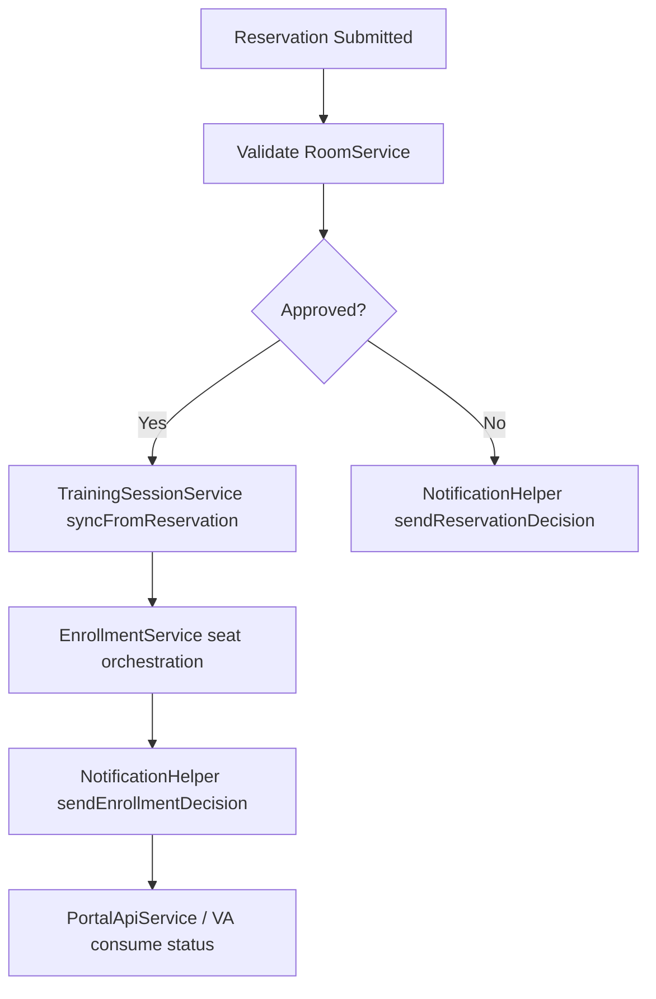
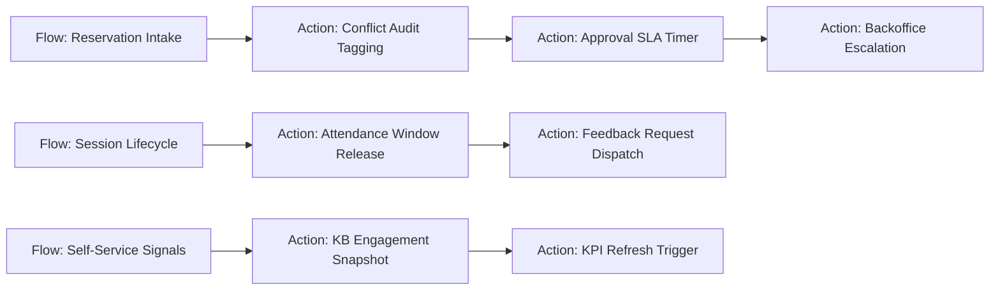

# TOCC Flow Orchestration Map

This folder is now used as the flow implementation map for handoff and upcoming Fluent Flow objects.

## Current (Implemented in Script Includes + BR + Scheduled Jobs)

## Next (Planned Fluent Flow API Objects)

## Rationale

- Keep runtime logic stable in Script Includes while Flow API coverage evolves by release.
- Use this map as implementation sequencing for US-28, US-29, and US-31 automation.
