# TOCC Flow Orchestration Map

This diagram reflects the **production flow architecture** implemented in `training-orchestration-flows.now.ts`.

## Flow Inventory

| ID | Flow | Trigger | Purpose |
|---|---|---|---|
| FLOW-01 | `[TOCC] Reservation Approval` | Record: Reservation `status=submitted` | Backoffice approval with session auto-creation |
| FLOW-02 | `[TOCC] Enrollment Approval` | Record: Enrollment `status=pending` | Direct or instructor-gated approval |
| FLOW-03 | `[TOCC] Session Cancellation Notification` | Record: Session `status=cancelled` | Mass notify enrolled students |
| FLOW-04 | `[TOCC] Attendance Confirmation Request` | Scheduled daily 08:00 | Confirmation requests within lead window |
| FLOW-05 | `[TOCC] Session Reminder Dispatch` | Scheduled daily 07:00 | Morning reminder batch |

## Subflow Inventory

| ID | Subflow | Called By |
|---|---|---|
| SF-01 | `[TOCC][SF] Process Reservation Decision` | FLOW-01 (approved + rejected branches) |
| SF-02 | `[TOCC][SF] Process Enrollment Decision` | FLOW-02 (direct + instructor branches) |
| SF-03 | `[TOCC][SF] Notify Session Participants` | FLOW-03, FLOW-04, FLOW-05 |
| SF-04 | `[TOCC][SF] Promote Waitlisted Student` | Called from EnrollmentService on seat release |

## Full Orchestration Diagram

```mermaid
flowchart TD
    subgraph FLOW01["FLOW-01: Reservation Approval"]
        R1[Reservation status=submitted] --> R2[Ask for Approval\nBackoffice Group]
        R2 -->|Approved| R3[SF-01: approved\n→ BR syncs session\n→ notify instructor]
        R2 -->|Rejected| R4[SF-01: rejected\n→ notify instructor]
    end

    subgraph FLOW02["FLOW-02: Enrollment Approval"]
        E1[Enrollment status=pending] --> E2{approval_mode?}
        E2 -->|direct| E3[SF-02: approved\n→ seats decremented\n→ notify student]
        E2 -->|instructor_approval| E4[Ask for Approval\nSession Instructor]
        E4 -->|Approved| E5[SF-02: approved\n→ seats decremented\n→ notify student]
        E4 -->|Rejected| E6[SF-02: rejected\n→ notify student]
    end

    subgraph FLOW03["FLOW-03: Session Cancellation"]
        C1[Session status=cancelled] --> C2[SF-03: cancelled\n→ notify all enrolled]
        C2 --> C3[Update work notes]
    end

    subgraph FLOW04["FLOW-04: Confirmation Request"]
        CR1[Daily 08:00] --> CR2[Find sessions in\nconfirmation window]
        CR2 --> CR3[SF-03: confirmation_request\n→ notify unconfirmed students]
    end

    subgraph FLOW05["FLOW-05: Session Reminders"]
        REM1[Daily 07:00] --> REM2[Find sessions in\nreminder window]
        REM2 --> REM3[SF-03: reminder\n→ notify enrolled students]
    end
```

## Design Rules

- **No business logic in Flows.** All validation and data operations go through Script Includes.
- **Script Include calls via `action.core.executeScript`** using `fd_data` for input/output binding.
- **`askForApproval`** uses `approver_source: 'group'` for Backoffice and `approver_source: 'user'` for Instructor.
- **`trigger_strategy: 'once'`** on FLOW-01 prevents re-triggering on subsequent status updates.
- **`trigger_strategy: 'unique_changes'`** on FLOW-03 fires only when status changes to cancelled (not on every update).
- **Subflows** reuse notification dispatch and decision logic — no duplication across parent flows.

## Relationship with Scheduled Jobs

Flows and Scheduled Jobs share responsibilities:

| Concern | Owner | Notes |
|---|---|---|
| Session reminders | Both SCH-001 (hourly) + FLOW-05 (morning batch) | FLOW-05 ensures morning delivery; SCH-001 catches late-added sessions |
| Release unconfirmed seats | SCH-002 (every 30min) | Flow-04 sends the request; SCH-002 enforces the consequence |
| Close past sessions | SCH-003 (daily 02:00) | Pure temporal — no Flow equivalent needed |
| Stale approval alerts | SCH-004 (daily 06:00) | Work note alerting — no Flow equivalent needed |

## Source of Truth

- All flows and subflows: `src/fluent/flows/training-orchestration-flows.now.ts`
- Activation steps post-deploy: `docs/manual-config/flow-activation.md`
- Approval group configuration: `docs/manual-config/instance-bootstrap.md`
