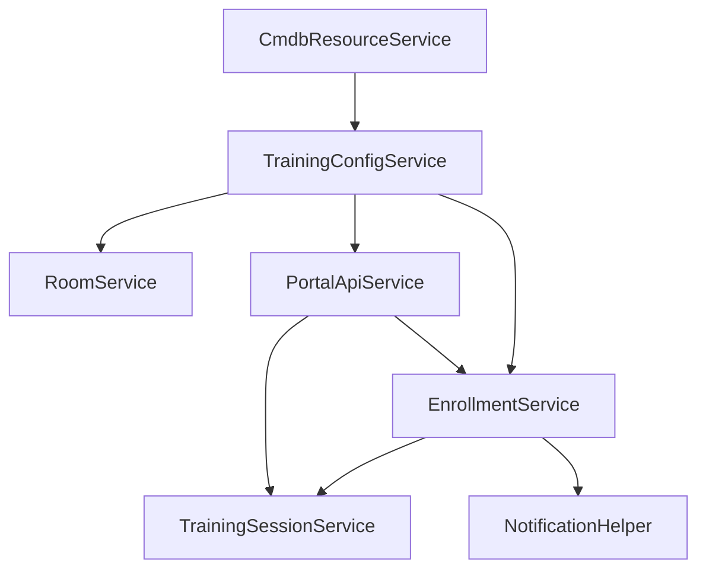

# TOCC Script Include Catalog

This folder documents the active Script Include architecture implemented under `src/fluent/logic`.

## Catalog

| Script Include | Responsibility |
|---|---|
| `RoomService` | Reservation conflict checks and date/capacity validation |
| `TrainingSessionService` | Session creation/synchronization and lifecycle updates |
| `EnrollmentService` | Enrollment policy enforcement, seat sync, waitlist promotion |
| `TrainingConfigService` | Runtime configuration gateway (table-driven thresholds) |
| `NotificationHelper` | Event queue abstraction for reservation/session/enrollment notifications |
| `PortalApiService` | Service Portal and VA data contract endpoints |
| `TrainingContextAjax` | Client-callable context enrichment for forms |
| `KnowledgeBaseBootstrapService` | Idempotent creation/update of KB base, categories, articles, and portal KB property |
| `CmdbResourceService` | CMDB CI validation and enrichment for room resources |

## Dependency Diagram

> Note: `KnowledgeBaseBootstrapService` is standalone — it has no runtime dependency on other Script Includes.
> `NotificationHelper` dispatches events via `gs.eventQueue` and does not call other Script Includes.

## Notes

- Script Includes remain code-first and fully versioned through SDK.
- UI Builder/VA-specific orchestration that is not fully Fluent-compatible should keep a paired runbook in `docs/manual-config`.
